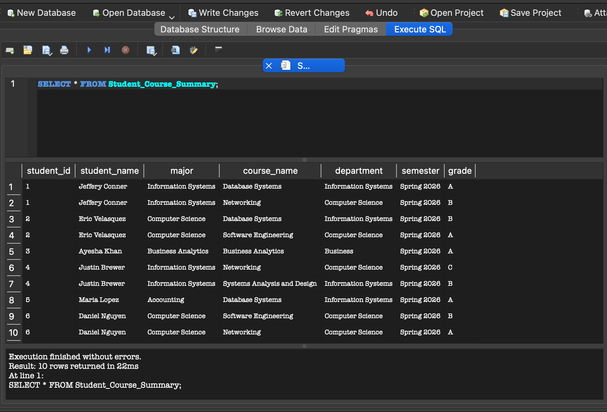
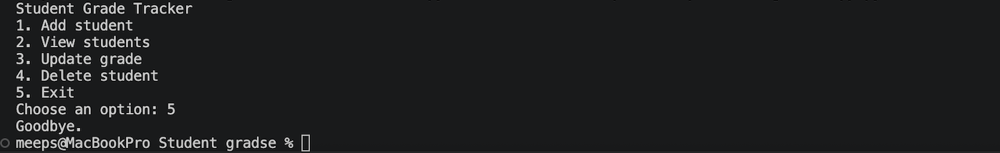

# Student Grade Tracker

This is a simple Python + SQLite application that allows users to manage student records through a command-line interface.

## Features
- Add a student
- View all students
- Update student grade
- Delete a student

## Technologies Used
- Python (SQLite3)
- SQL (SQLite)

## How to Run
1. Open the project in VS Code
2. Run the program:
   python3.12 app.py

## Project Structure
- app.py → main application logic
- students.db → SQLite database
- schema.sql → table structure
- inserts.sql → sample insert queries
- queries.sql → example queries
- view.sql → SQL view for student data

## Screenshots

### Application Menu

### Program Output

## What I Learned
- How to connect Python to a SQL database
- How to perform CRUD operations
- How to structure a simple database application
